# Taller Evaluativo 2025-2

📌 **Proyecto Maven con Spring Boot**  
Este repositorio implementa la solución al Taller Evaluativo siguiendo principios **SOLID**, pruebas unitarias con **JUnit 5**, cobertura con **JaCoCo (≥ 80%)**, e integración con **Sonar**.

#### Integrantes

- Tomas Felipe Ramirez Alvarez

## ⚙️ Requisitos del entorno

- **Java JDK 17**
- **Apache Maven 3.9.x**
- **Spring Boot 3.3.3**
- **JUnit 5**
- **JaCoCo** (plugin Maven)
- **SonarQube / SonarCloud**

-------------------------------------------------------------------------------------
## 📖 Descripción del taller

### 1. Crear un repositorio en GitHub con un proyecto **Maven + Spring Boot** y su respectivo README.

- 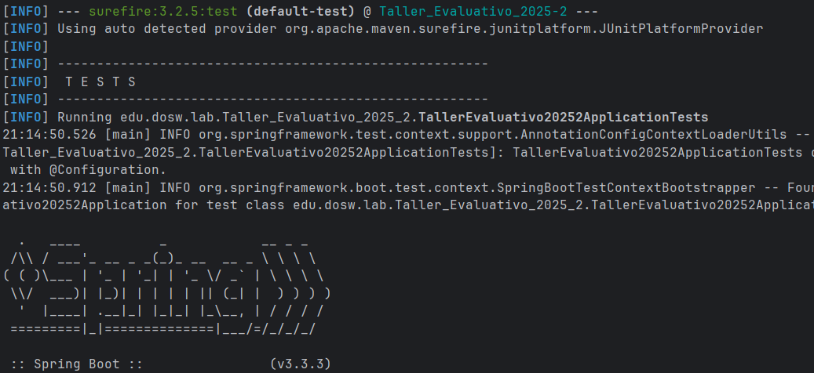
- 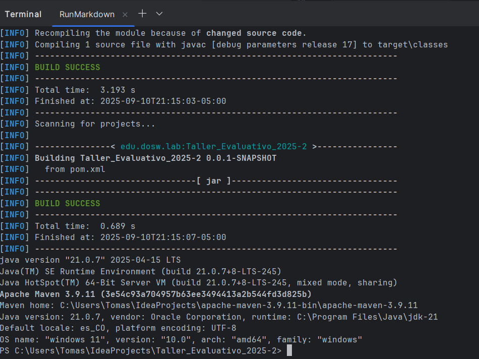
- Se puede evidenciar que el taller corre perfectamente con los parametros pedidos, se toma captura de los momentos
mas relevantes del test corriendo de igual mandera al final del readme se deja los comandos para correrlo

-----
### 2. Resolver los requerimientos del cliente siguiendo **principios SOLID**.
##### S (Single Responsibility Principle)Cada clase tiene una responsabilidad clara:
   - Producto → solo modela un producto.
   - ServicioInventario → administra el stock y notifica a los agentes.
   - Agentes → contiene las implementaciones de notificación.
   - Excepciones → agrupa los errores del dominio.

##### O (Open/Closed Principle) El sistema está abierto a extensión pero cerrado a modificación:

- Puedes crear nuevos agentes (AgenteEmail,AgenteWebhook, etc.) sin cambiar ServicioInventario.
Basta con implementar la interfazAgente y registrarlo.

##### L (Liskov Substitution Principle)
- Todos los agentes implementan la misma interfaz (Agente) y se pueden usar indistintamente en ServicioInventario.

##### I (Interface Segregation Principle)
- La interfaz Agente es pequeña y específica (notificar(Producto producto)), no obliga a implementar métodos innecesarios.

##### D (Dependency Inversion Principle)
ServicioInventario no depende de implementaciones concretas (AgenteLog,AgenteAdvertencia), sino de la abstracciónAgente.

-----
### 3. Implementar al menos un **patrón de diseño** y explicar su selección.
#### Se implementó el Patrón Observer (u Observador).

- Es un modelo de diseño que facilita que un objeto (sujeto) informe automáticamente a otros objetos (seguidores) cuando 
su estado se modifica, sin que el sujeto necesite conocer información específica sobre los seguidores.

- Sujeto (Subject): ServicioInventario

- Observadores (Observers): AgenteLog y AgenteAdvertencia

- Relación: cada vez que cambia el stock,ServicioInventario notifica automáticamente a todos los agentes registrados.

¿Por qué Observer?
- Porque existía una situación (cambio de inventario) que necesitaba ser comunicada a varios interesados (agentes).
  Facilita la inclusión de más agentes más adelante sin modificar la lógica principal.
  Se adapta idealmente a la necesidad de “informar a los interesados”.

-----

4. Incluir diagramas de **Contexto**, **Casos de uso** y **Clases**.
Comenzaremos Con el diagrama de contexto:

   - El cual es tiene que ser algo muy general pero que muestre los agentes que estan interactuando con el sistema
   - 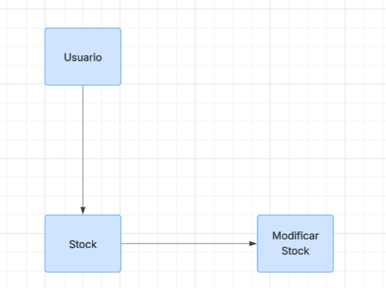
- Diagrama de caso de uso:
  - El cual muestra el flujo que debe tener el sistema y los actores que interactuan con el
  - 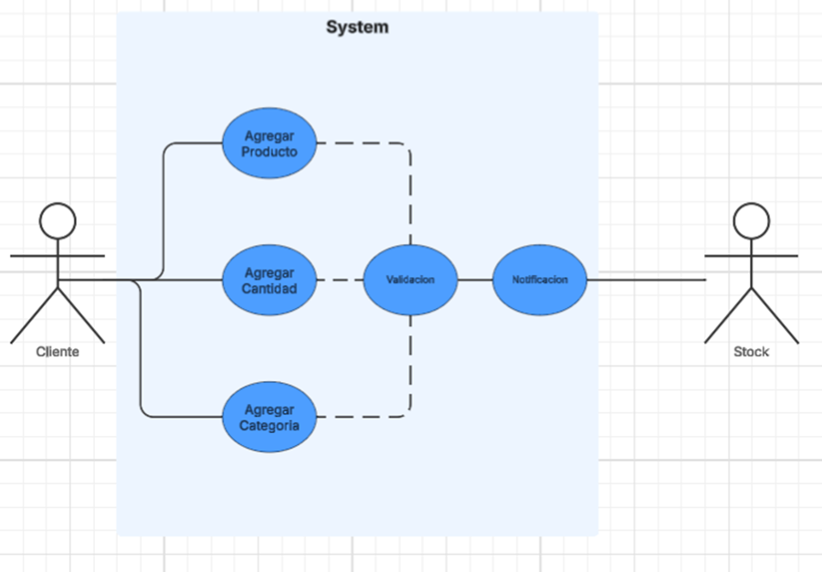
- Diagrama de clases:
  -  Es el proceso de representar gráficamente las clases, sus atributos, métodos y las relaciones entre ellas.
  - 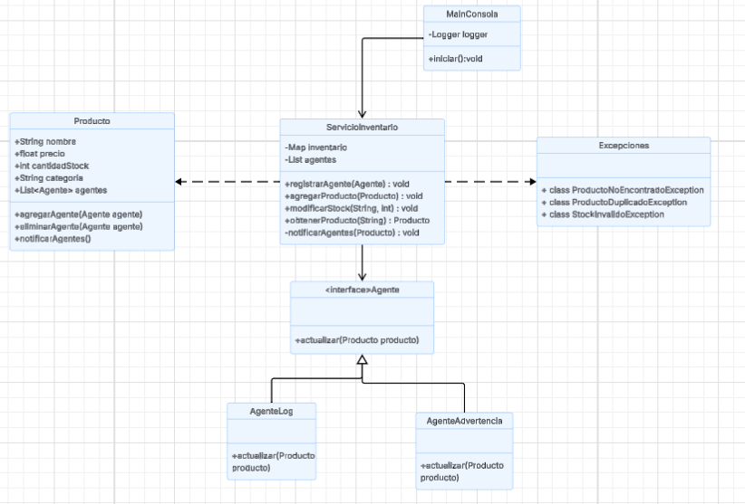
  
----
5. Identificar criterios de aceptación y organizar el plan de trabajo con **Épicas**, **Features** y **Historias de Usuario (HU)**.
- #### Épicas Principales
    - Gestión Básica de Inventario - Funcionalidades principal del sistema
    - Sistema de Notificaciones - Alertas y observadores de cambios
    - Gestión de Errores - Validaciones y excepciones
    - Interfaz de Usuario - Consola interactiva

- #### Features
    - 1 Crear productos
    - 2 Consultar productos
    - 3 Actualizar stock
    - 4 Validar datos de productos
    - 5 Registro de agentes notificadores
    - 6 Notificaciones de cambios de stock
    - 7 Alertas de stock bajo
    - 8 Validación de stock negativo
    - 9 Control de productos duplicados
    - 10 Manejo de productos no encontrados
    - 11 Menú de opciones
    - 12 Entrada de datos por consola
    - 13 Flujo completo de operaciones

- #### Historias de Usuario (HU)
    - Como usuario, quiero agregar un producto al inventario para que esté disponible para venta.
    - Como usuario, quiero modificar la cantidad de un producto para reflejar ventas o reposición.
    - Como usuario, quiero obtener los detalles de un producto específico para revisar información antes de vender o reponer.
    - Como administrador, quiero registrar agentes para que reciban notificaciones cuando se agregue
    - Como administrador, quiero que un agente genere advertencias cuando el stock de un producto
-----
6. Usar **inyección de dependencias** para instanciar objetos.
   - Para que haya inyeccion de dependencias se uso spring boot y sus anotaciones con el fin de que spring se encargue de 
   manejar las dependencias y que las clases no tenga esa responsabilidad con eso cada clase hace lo que tiene que hacer sin
   interrumpir el flujo de la aplicacion.
----

7. Implementar pruebas unitarias con **JUnit 5**.
- 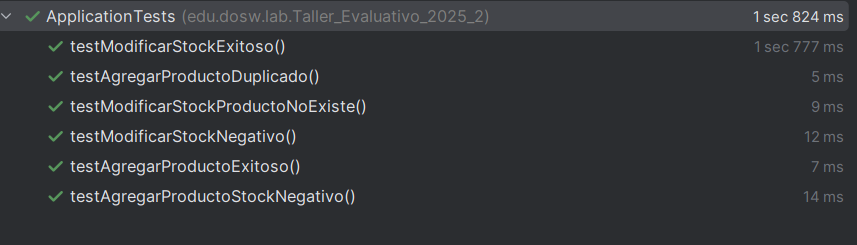
- 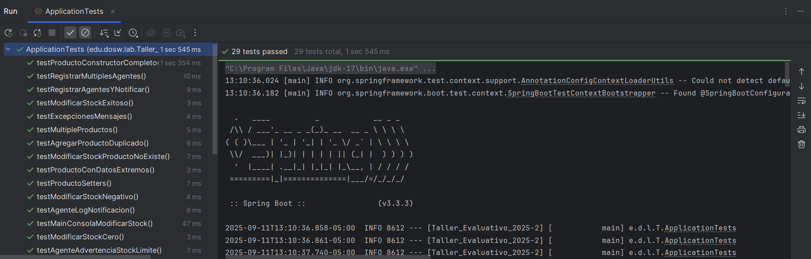
------ 

8. Integrar **JaCoCo** y **Sonar**, asegurando una cobertura mínima del **80%**.
- 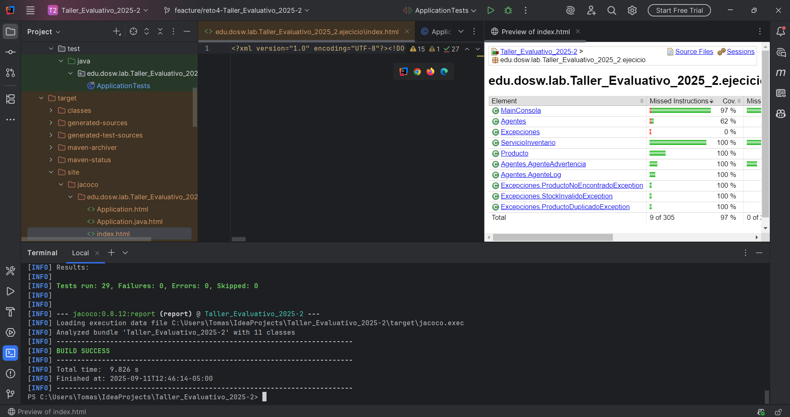
- 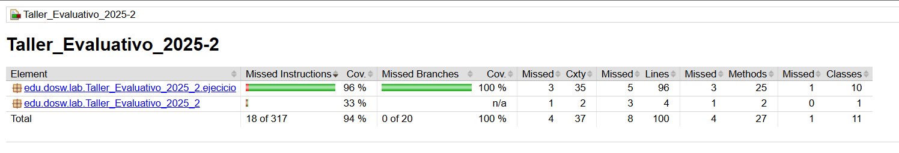
----

9. Documentar evidencias del funcionamiento y explicar comandos Maven para correr el software.
- Hacemos el caso de prueba con el del documento el cual es un xbox one s con 10 unidades
luego le quitamos 6 unidades y si quedan menos de 5 unidades el arroja la alerta como se ve en los 
pantallazos.
  - 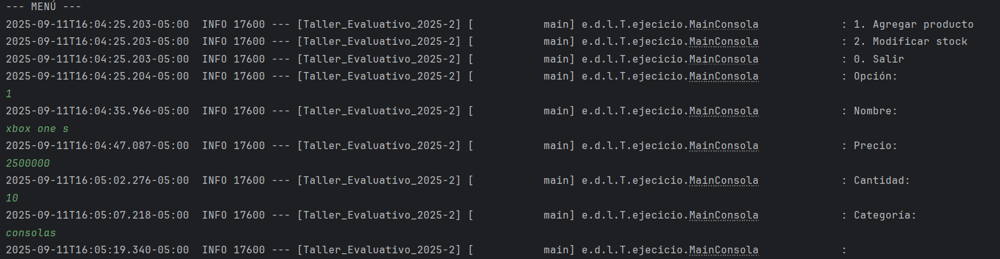
  - 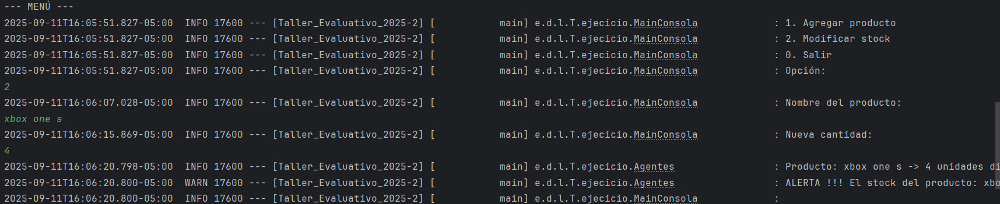
Ahora unos pantallazos de todo el funcionamiento donde se ve el jacoco, junit y sonar.
  - 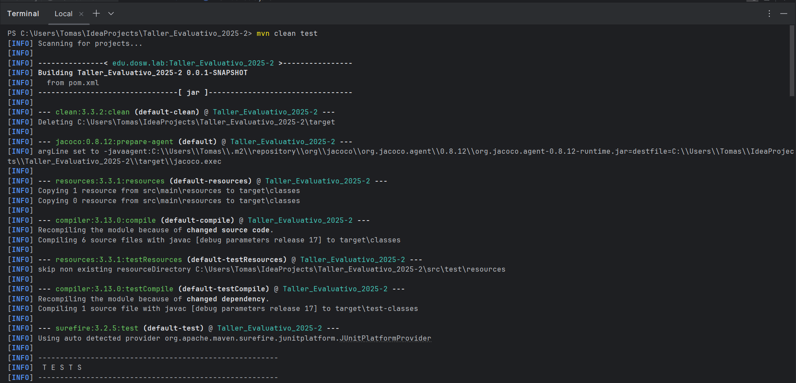
  - 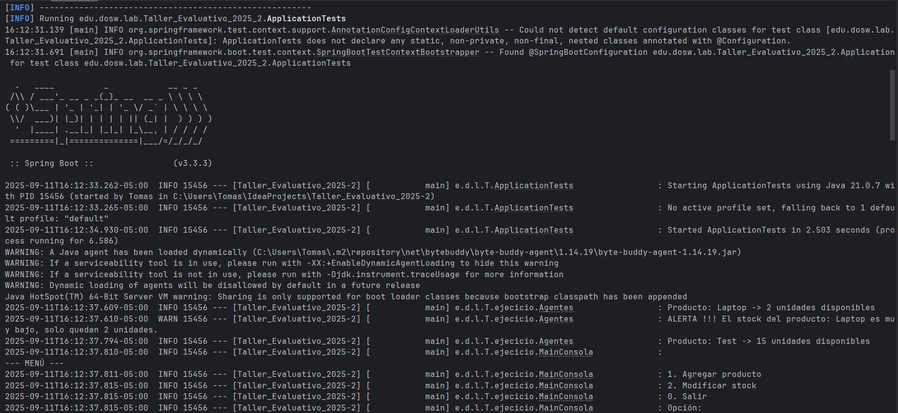
  - 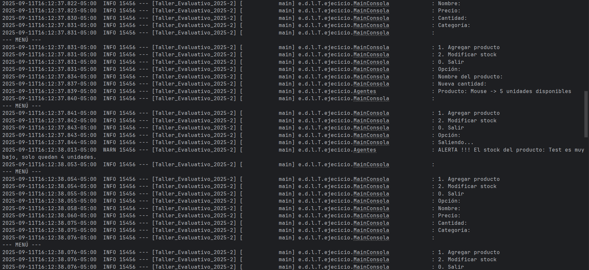
  - 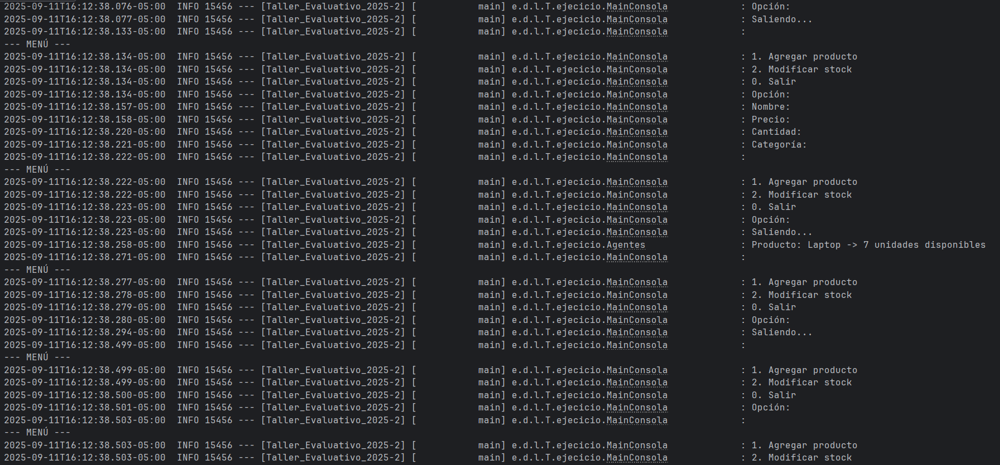
  - 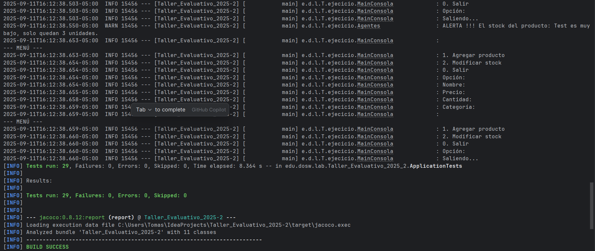
  - 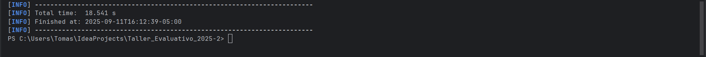
- #### Nota: importante si quieres correr todo el test para probarlo con el comando mvn clean test y se reflejara los pantallazos anteriores

## 🚀 Comandos básicos
- Comandos para instalar, compilar, testear y ejecutar la aplicación:
```bash
# Verificar instalación
mvn -v
java -version

# Validar POM
mvn validate

# Compilar
mvn clean compile

# Ejecutar pruebas y generar reporte JaCoCo
mvn clean test

# Arrancar aplicación
mvn spring-boot:run

